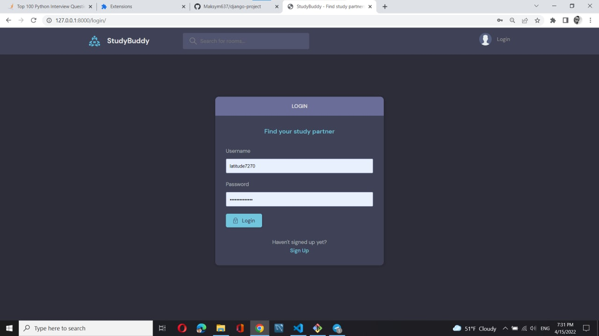
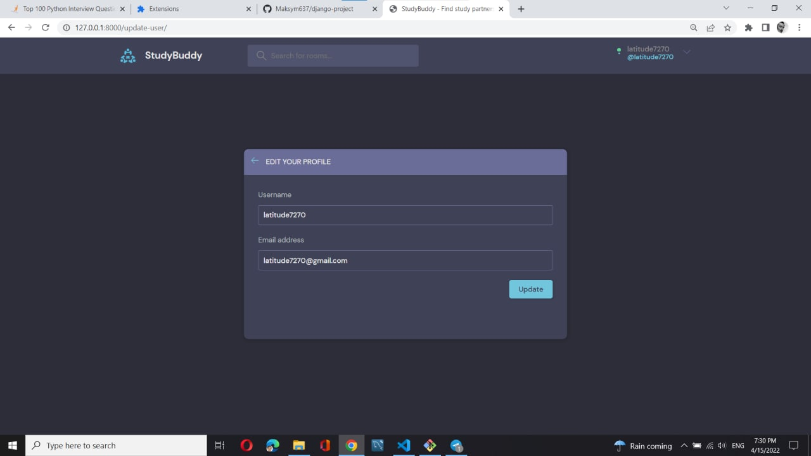
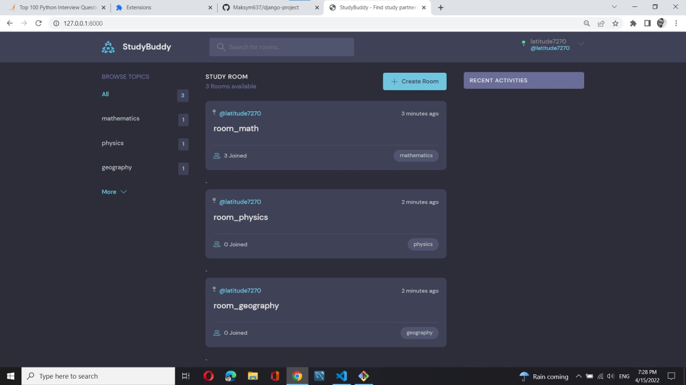
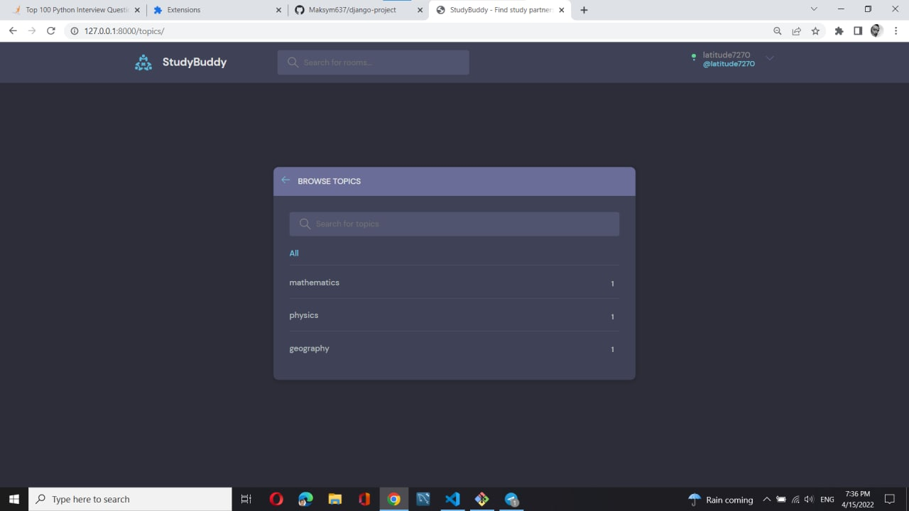
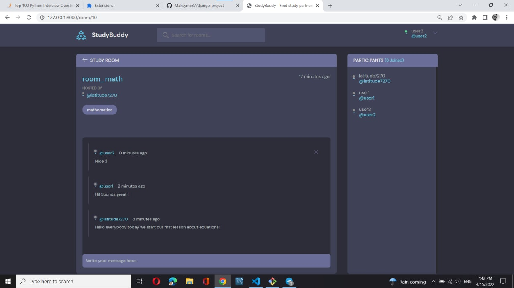

# django-project
- - - 
#### _example project_
- - - 
### Description
* **about django :**
  * python web framework
  * server side framework
  * designed to get you

* **about project :**
  * This is  a simple _web application_ for creating study rooms.
    
    Here you can create rooms and topics that interest you in and  communicate with other participants.
  * Backend (server side):
    _php_, _django_ and _REST API_
  * Frontend (client side):
    _angular_ + _django_
- - -
### Overview
**_Login page_**

**_Edit user page_**

**_Home page_**

**_Topics page_**

**_Chat room page_**

- - -